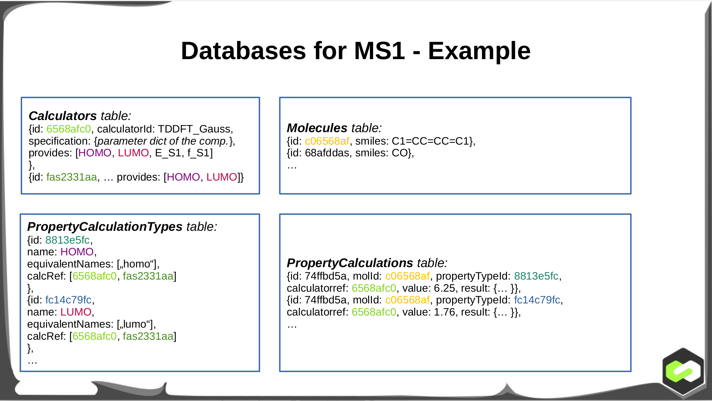

# Diadem Image Template

This repository contains the minimal code required to create an image required to run a scientific diadem  workload via the Azure Batch service. The general workflow is: You provide a conda environment file, which is rendered to an explicit conda.lock (fixing all package versions and md5s), which is then used to build the docker image.
Extra scripts / binaries you require will be included in the diadem\_image\_template/opt folder automatically.

## Getting started
Clone this repository and rename it. Edit project\_config.sh and give it an appropiate name, such as `xtb\_example`.

## Diadem Payload
On the live server, your container will be executed in a working directory with the two files

* molecule.yml, containing the smiles code
* calculator.yml, containing information about the calculation to be done

These files are directly taken from the Diadem databases outlined in the following image:


Define the Calculators.yml your calculator will receive. For our XTB example, we will use the following:

```
calculator_id: XTB_example
provides:
- HOMO
- LUMO
specifications:
  numsteps: 200
```
For a DFT Payload specifications could include Basis, Functional, convergence criteria, etc. It does not have to be a flat dictionary. The only requirement is that it is serializable into a list of dicts of dicts of lists... of python base types. Your payload then runs and must output a file called result.yml according to the following spec:

```
molecule_id:
  HOMO:
    value: 5.0
    result:
      free_form_list: [ A, B, C ]
      free_form_dict: { A: B, C:D }
  LUMO:
    value: 5.0
```
value has to be orderable (int, float, string, but not list of string). result is free form and includes additional data about this calculation. result is optional and can be omitted.

## Setting up the environment
Edit the diadem\_image\_template/env.yml file. This contains the specification of the conda environment, which will be rolled out inside the docker image. Only include direct dependencies in this file, i.e.: If you would include  matplotlib, which require the expat library, only include matplotlib. If you want a good env file for starting, you can prepare a conda environment with the tools you need and export it. You will need docker installed and the docker daemon running to go through this tutorial.

### Example: XTB and openbabel environment
We will now generate an environment containing XTB and openbabel. To start we installed Mambaforge for our architecture from here: https://github.com/conda-forge/miniforge . and set up an environment with the following script:

    mamba create --name=xtbdevenv xtb=6.6.0 openbabel
    conda activate xtbdevenv
    mamba env export > env.yml
    cat env.yml

This outputs:
````{verbatim}
name: base  #<- keep or set this one to base.
channels:
  - conda-forge
dependencies:
  - _libgcc_mutex=0.1=conda_forge
  - _openmp_mutex=4.5=2_gnu
  - bzip2=1.0.8=h7f98852_4
  - ca-certificates=2022.12.7=ha878542_0
  - cairo=1.16.0=ha61ee94_1014
  - dftd4=3.5.0=h03160e7_0
  - expat=2.5.0=h27087fc_0
  - font-ttf-dejavu-sans-mono=2.37=hab24e00_0
  - font-ttf-inconsolata=3.000=h77eed37_0
  - font-ttf-source-code-pro=2.038=h77eed37_0
  - font-ttf-ubuntu=0.83=hab24e00_0
  - fontconfig=2.14.2=h14ed4e7_0
  - fonts-conda-ecosystem=1=0
  - fonts-conda-forge=1=0
  - ncurses=6.3=h27087fc_1
  - openbabel=3.1.1=py311h7c3e0e0_5
  - openssl=3.0.8=h0b41bf4_0
  - pcre2=10.40=hc3806b6_0
  - pip=23.0.1=pyhd8ed1ab_0
  - pixman=0.40.0=h36c2ea0_0
  - pthread-stubs=0.4=h36c2ea0_1001
  - python=3.11.0=he550d4f_1_cpython
  - xorg-xextproto=7.3.0=h7f98852_1002
  - stuff_ommited_here
  - xorg-xproto=7.0.31=h7f98852_1007
  - xtb=6.6.0=h03160e7_0
  - xz=5.2.6=h166bdaf_0
  - zlib=1.2.13=h166bdaf_4
prefix: /home/strunk/mambaforge/envs/xtbdevenv
````
We will edit this file to only include dependencies, we require directly and packages we care about, such as packages our own scripts requires (e.g. the python version).


````{verbatim}
name: base
channels:
  - conda-forge
dependencies:
  - openbabel=3.1.1
  - python=3.11.*
  - xtb=6.6.0
  - yaml=1.5.2 <- always include yaml, you need it to parse the input files.
````
We will edit this file to only include dependencies, we require directly and packages we care about, such as packages our own scripts requires (e.g. the python version). Note that we whitelisted all newer python point releases and also removed the build string (such as h031607). This will be fixed in the next stage. When you are happy with your environment file, move it to the diadem\_image\_template subfolder and commit it to the repository. If you require extra scripts or binaries put them in the diadem\_image\_template/opt subfolder. Remember to consider that you have to include the dependencies for your binaries in the conda env file.

### Locking the environment
Inside the diadem\_image\_template folder: The env file is the file specifying, what you need. For operational stability, we will now lock down, how the package manager fulfilled this request and record it. Call the script `../scripts/create_lock.sh`. Docker will now build a temporary image, install the environment and output an env.lock file. Commit it to the repository.

### Push a git tag
To allow for automatic versioning of the image, add a tag, like this:

```
    git tag -a "name_as_in_project_config.sh/v0.0.1" "First version definition"
    git push origin "name_as_in_project_config.sh/v0.0.1"
```

This will alllow automatic tagging of generated images. Everytime you want to not only build an image (for example for testing) but also upload it (for deployment on the diadem infrastructure), you need to set an explicit tag with a version higher than the last one and push it like above. If you want to know the current version, just use `git describe` (after the first tag).

### Building the image
Inside the diadem\_image\_template folder: Make sure there is nothing uncommited in the repository and call `../scripts/build_docker_image.sh`. The image will be tagged with the output of git describe (i.e. the most current tag modified).

### Testing the image
The image should now contain all dependencies required to execute your scientific software. If you run pytest, the image will be tested with all combinations of Calculators defined in `Calculators/*.yml` and `Molecules` defined in tests/inputs/molecules`. For every test done, a folder tests/calculator/molecule will be generated. If the test was successful, the generated result.yml will be put into this folder. If you move result.yml to result_reference.yml and add it to the repository, the next time a test is run, the two dictionaries will be compared and an error generated if they differ.
